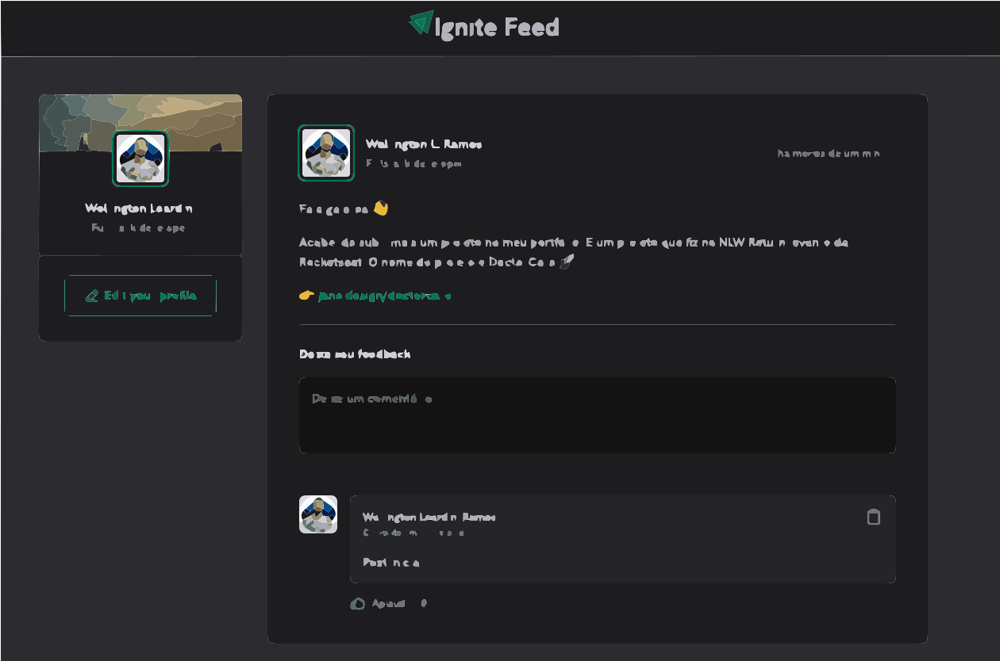

# Ignite Feed

Developed a timeline feed.

## Motivation

Improve the my front-end skills following a Front-end Senior approach

## Technologies

-> React 18

-> Vite

-> Stitches

## Running locally

```bash
#clone
git clone https://github.com/rwellingtonr/ignite-feed.git
# move to the page
cd ignite-feed
# install all the packages
yarn
# Run as dev
yarn dev
```

## Result


